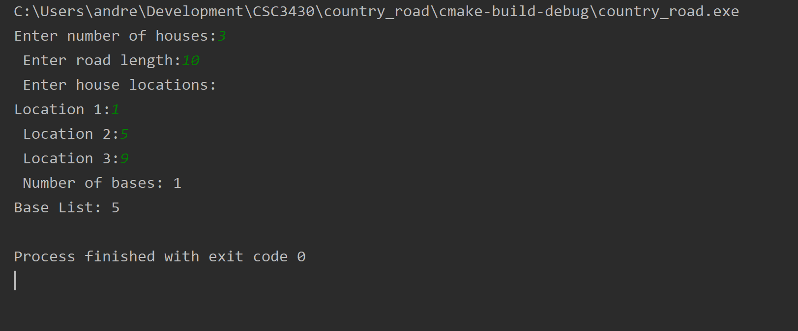
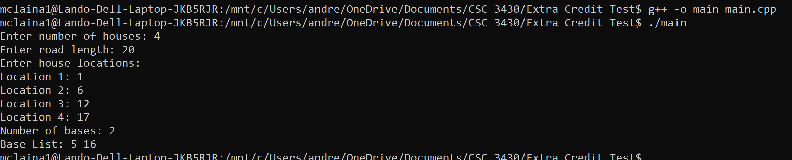

# PROBLEM
Let’s consider a long, quiet country road with houses scattered very sparsely along it. (We can picture the road as a long line segment, with an eastern endpoint and a western endpoint.) Further, let’s suppose that despite the bucolic setting, the residents of all these houses are avid cell phone users. You want to place cell phone base stations at certain points along the road, so that every house is within four miles of one of the base stations. 
Give an efficient algorithm that achieves this goal, using as few base stations as possible. 
# SOLUTION
In order to minimize the number of base stations, we can move from west to east and try to place each new base station as far east as possible as we move along. This greedy algorithm would “stay ahead” of all other solutions by ensuring the number of base stations over a given distance is always minimized. In order to do this, while moving west to east, each time we encounter a house we place a base station 4 miles to the east of it. Unless, of course, the house is already in range of a base station, in which case we would move to the next house. 
# IMPLEMENTATION
This program takes user input for the number of houses, road length, and locations of each house. The locations of each house are represented as an integer distance (in miles) from the westmost point. It is assumed that the user does not try to enter invalid input to crash the program. The program sorts the houses by increasing distance from the westmost point after the user inputs the values, so that it can move from west to east as described in the solution. A base cannot be placed in a position that exceeds the road length, so if the house being checked does not have a base within 4 miles and is also less than 4 miles from the end of the road, then the base will be placed at the end of the road. 
# HOW TO RUN THE PROGRAM
Running in CLION  
I ran the program with all of the files in this repository as a project using the CLION IDE, which provides debugging and other functionality. Below is an image and video example of this method.  
<a href="https://youtu.be/mZ0JT0q4JOo">YouTube Running in CLION</a> 
  
Running from Terminal  
Below is an image and video example of running from the terminal using the g++ compiler. 
<a href="https://youtu.be/JxLxvttnl28">YouTube Running from Command Line</a> 
 
